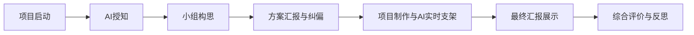

# “AI授知—教师导学—项目共创”人工智能通识PBL课堂模式

## 一、模式提出背景

人工智能通识教育正在进入中小学课堂，但在真实教学中面临两个突出问题。

第一，学生对传统“教师讲、学生听”的课堂参与意愿有限。人工智能课程具有较强的体验性、互动性和生成性，如果仍然采用单向讲授方式，容易削弱学生的学习兴趣，也难以体现人工智能课程本身的特点。

第二，人工智能通识课程是一类新兴课程，内容更新快、概念抽象、跨学科特征明显。很多中小学教师并非人工智能专业背景，未必能够稳定、准确、生动地完成 AI 知识讲授。

因此，人工智能通识课堂不能简单沿用“教师主讲”的传统模式，也不能退化成“学生独自面对 AI 系统的在线自学”。更合理的方向是：依托 AI Agent 系统承担知识讲解、互动体验、任务支架和过程反馈，同时发挥线下教师在通用教学法、项目组织、协作管理、价值引导和综合评价方面的作用。

基于这一现实需求，可以提出一种新的课堂模式：

> **“AI授知—教师导学—项目共创”人工智能通识PBL课堂模式。**

---

## 二、模式定义

**“AI授知—教师导学—项目共创”人工智能通识PBL课堂模式**，是指在人工智能通识教育中，以真实问题或项目挑战为驱动，由 AI Agent 系统承担知识讲解、案例演示、任务支架、学习记录、实时反馈和过程评价，由线下教师组织项目启动、小组协作、方案纠偏、阶段导学、成果汇报和综合评价，由学生在持续探究、项目制作、公开展示、互评反思中完成 AI 知识理解、实践应用和素养发展的项目式学习模式。

该模式的核心不是让 AI 完全替代教师，也不是让教师继续承担全部 AI 专业知识讲授，而是形成一种新的课堂分工：

> **AI 负责授知、支架、记录与过程评价；教师负责启动、导学、纠偏、组织汇报与综合评价；学生通过项目共创完成 AI 通识素养建构。**

---

## 三、模式核心思想

### 1. AI Agent 负责“授知”和“支架”

AI Agent 系统主要承担人工智能课程中专业性较强、教师不一定能够稳定讲授的内容，包括：

- 核心概念讲解；
- 案例演示与互动体验；
- 个性化答疑；
- 项目方案建议；
- 实时修改反馈；
- 学习过程记录；
- 过程性评价与个性化反馈。

AI 的价值不只是“生成课件”，而是作为学生项目学习过程中的持续支架。

### 2. 教师负责“导学”和“组织”

教师不再被定位为 AI 专业知识主讲者，但也不是旁观者或纪律监督者。教师的核心作用是运用通用教学法组织线下项目式学习，包括：

- 创设真实问题情境；
- 说明项目目标、成果形式和评价标准；
- 组织分组与小组协作；
- 引导学生进行方案汇报与纠偏；
- 观察项目推进过程；
- 防止学生直接依赖 AI；
- 组织最终汇报、互评和反思；
- 将项目经验提升为对 AI 的理解、判断和责任意识。

### 3. 学生负责“项目共创”

学生不是被动听 AI 讲，也不是简单完成系统任务，而是在真实问题情境中完成：

- 问题理解；
- 小组构思；
- 项目方案设计；
- 项目制作；
- 成果展示；
- 同伴互评；
- 自我反思。

学生在项目共创中形成对人工智能的通识性理解，而不是只记住概念或完成测验。

---

## 四、模式整体流程

该模式是以一套完整的项目式学习课程为组织框架。完整流程包括七个阶段：

七个阶段之间不是简单线性完成，而是围绕项目目标不断推进。尤其在“项目制作与 AI 实时支架”阶段，AI 会持续参与学生的项目制作、修改和反馈过程。

---

## 五、七个阶段的具体说明

### 阶段一：项目启动

**核心任务：** 教师提出真实问题，明确项目目标、成果要求和学习规则。

教师通过生活化、情境化问题启动项目。例如：

- 中学生应该如何正确、负责地使用 AI？
- AI 图像识别为什么会出错？
- ChatGPT 的回答是否一定可信？
- 我们能否设计一份面向同学的 AI 使用指南？
- 我们能否设计一个校园 AI 应用方案，并分析其风险？

在这一阶段，教师主要负责项目导入，而 AI 可以提供项目背景材料、案例、情境故事和驱动问题参考。

| 主体 | 主要任务 |
|---|---|
| 教师 | 提出真实问题，说明项目目标、成果形式、规则与评价要求 |
| AI | 生成背景资料、案例材料、驱动问题参考 |
| 学生 | 理解项目任务，形成初步兴趣，完成小组组建 |

### 阶段二：AI授知

**核心任务：** AI 系统讲解完成项目所需的基础知识。
课前老师在系统中设置教学目标，
学生在 AI Agent 系统中完成基础知识学习。AI会根据学生的表现动态调整教学路径，但是最终一定要达到教师所设置的教学目标。不欠缺、不超纲。AI 通过互动讲解、案例演示、小测和问答帮助学生理解项目所需的核心概念。

例如，在“中学生 AI 使用指南”项目中，AI 可以讲解：

- 什么是生成式 AI；
- AI 能做什么，不能做什么；
- 什么是 AI 幻觉；
- 什么是数据隐私；
- 什么是算法偏见；
- 为什么不能盲目相信 AI 输出。

这一阶段的关键是：AI 负责专业知识输入，教师负责组织学习节奏和确认学生是否完成基础学习。

| 主体 | 主要任务 |
|---|---|
| AI | 个性化讲解核心知识，展示案例，组织互动与小测 |
| 教师 | 设置教学目标，组织学生进入系统，维持学习节奏，确认关键概念 |
| 学生 | 跟随 AI 完成知识学习，记录与项目相关的概念 |

### 阶段三：小组构思

**核心任务：** 学生基于真实问题形成项目初步方案。

学生在小组内讨论项目选题、成果形式、任务分工和实施计划。AI 可以提供项目模板、案例、方案建议和分工参考，但学生必须做出自己的选择。

例如，学生可以选择完成：

- 一份《中学生 AI 使用指南》；
- 一个“AI 能力与风险”科普海报；
- 一个 AI 误判案例分析报告；
- 一个校园 AI 应用设计方案；
- 一个生成式 AI 合理使用微视频；
- 一次面向同学的 AI 使用调查。

| 主体 | 主要任务 |
|---|---|
| AI | 提供项目模板、案例、方案建议和分工计划参考 |
| 教师 | 组织小组讨论，帮助明确项目成果形式 |
| 学生 | 选择项目主题，确定目标、分工和初步计划 |

### 阶段四：方案汇报与纠偏

**核心任务：** 学生先汇报方案，再由 AI、教师和同伴共同给予反馈，避免项目方向偏差。

这是 PBL 中非常关键的前置纠偏环节。学生不能一开始就直接制作最终作品，而应先说明自己“打算做什么、为什么做、怎么做”。

小组方案汇报可以包括：

1. 我们要解决的问题是什么；
2. 我们准备完成什么项目成果；
3. 我们打算如何制作；
4. 我们需要用到哪些 AI 知识；
5. 我们会如何使用 AI；
6. 我们可能遇到哪些风险或困难。

反馈由三部分组成：

| 反馈来源 | 反馈重点 |
|---|---|
| AI | 方案是否完整，是否遗漏关键知识，是否存在风险 |
| 教师 | 问题是否清楚，任务是否可行，方向是否符合项目目标 |
| 同伴 | 是否听得懂，是否有吸引力，是否有改进建议 |

这一阶段的价值在于：在学生正式投入制作前，先完成方向、问题、成果和标准的校准。

### 阶段五：项目制作与AI实时支架

**核心任务：** 学生根据纠偏后的方案正式制作项目，AI 在全过程中实时提供支架和反馈。

这一阶段是项目式学习的核心。学生开展资料搜集、方案细化、作品制作、测试修改和成果完善。

项目进行过程中，学生可能不断产生新的问题。这些知识未必属于教师原来预设的基础知识。此时：AI根据学生当前任务和问题，提供即时讲解、案例说明和知识补充。“先达标、后探究；边实践、边学习”的学习逻辑。

AI 不再作为一个单独的“作品优化阶段”出现，而是嵌入学生项目制作全过程，提供实时支持：

知识补充与即时讲解；
案例说明与概念解释；
任务提示与学习建议；
作品诊断与修改反馈；
表达优化与汇报指导；
风险提醒与伦理分析；
学习过程记录与反思支持。

教师在这一阶段不负责替学生讲解复杂 AI 技术，而是负责线下导学：

- 观察小组合作是否真实；
- 协调小组分工；
- 控制项目进度；
- 防止学生直接依赖 AI；
- 提醒学生保留 AI 使用记录；
- 关注项目是否偏离主题；
- 选择后续汇报中的代表性案例。

可以概括为：

> **AI 优化作品，教师优化学习过程。**

### 阶段六：最终汇报展示

**核心任务：** 学生公开展示最终项目成果。

项目完成后，每个小组需要进行最终汇报。汇报不只是展示作品，还要说明项目过程。

最终汇报建议包括：

1. 项目问题与目标：说明小组要解决的核心问题是什么，为什么选择这个问题，项目希望达成什么目标。
2. 项目设计思路：说明小组是如何理解问题、分析问题，并形成解决方案的。包括整体思路、设计依据和关键决策。
3. 项目实施过程：介绍小组完成项目的主要步骤，例如资料查找、方案设计、实践操作、测试修改等过程。
4. 小组分工与合作：说明每位成员承担的任务，以及小组在讨论、协作和解决分歧中的表现。
5. 项目成果展示：展示最终形成的作品、方案、报告、模型、程序、海报或课堂活动设计等成果，并说明其主要功能和特点。
6. 问题解决效果：说明项目成果是否解决了最初提出的问题，有哪些证据可以证明成果有效，例如测试结果、用户反馈、数据分析或案例说明。
7. 困难与改进过程：说明项目过程中遇到了哪些困难，小组如何调整方案、优化作品或改进方法。
8. 反思与后续优化：总结本次项目学习的收获、不足，以及如果继续完善项目，下一步可以如何改进。

这一阶段体现了 PBL 的公开展示要求。学生不仅要“做出来”，还要“讲清楚”；不仅要展示最终成果，还要呈现从问题发现、方案形成、合作探究到反思改进的完整学习过程。

### 阶段七：综合评价与反思

**核心任务：** 形成 AI 过程评价、教师评价、学生互评和学生自评共同构成的综合评价体系。

评价不能只看最终作品，也不能只依赖 AI 自动评分。应形成多元评价结构。

| 评价主体 | 评价重点 | 评价内容 |
|---|---|---|
| AI 评价 | 学习过程 | 学习轨迹、任务完成、修改次数、AI 使用记录、过程参与 |
| 教师评价 | 项目质量与汇报表现 | 知识准确性、项目完整性、问题解决、表达展示、价值反思 |
| 学生互评 | 同伴理解与作品价值 | 作品清晰度、吸引力、创新性、可用性、展示效果 |
| 学生自评 | 个人成长 | 我学到了什么，AI 如何帮助我，我如何判断 AI，下一次如何改进 |

可以设置如下参考权重：

| 评价部分 | 建议权重 |
|---|---:|
| AI 过程性评价 | 30% |
| 教师项目与汇报评价 | 40% |
| 学生互评 | 20% |
| 学生自我反思 | 10% |

评价逻辑可以概括为：

> **AI 评过程，教师评质量，同伴评表达，自我评成长。**

---

## 六、AI、教师与学生的角色分工

| 主体 | 角色定位 | 核心任务 |
|---|---|---|
| AI Agent 系统 | 授知者、支架者、记录者、过程评价者 | 讲解知识、提供案例、辅助构思、实时指导、记录过程、生成反馈 |
| 线下教师 | 导学者、组织者、纠偏者、评价者、价值引导者 | 启动项目、组织分组、引导讨论、纠偏方案、管理协作、组织汇报、综合评价 |
| 学生 | 探究者、设计者、制作者、汇报者、反思者 | 理解问题、设计方案、制作成果、展示汇报、互评反思 |

该分工说明，教师并没有被 AI 替代。教师只是从“AI 知识主讲者”转变为“项目式学习的导学者与组织者”。

---

## 七、模式结构图示

```mermaid
flowchart TB
    subgraph AI[AI Agent 系统支持]
        A1[项目背景支持]
        A2[AI授知与互动学习]
        A3[方案构思支持]
        A4[方案诊断与修改建议]
        A5[实时支架与过程记录]
        A6[汇报准备支持]
        A7[过程评价与个性反馈]
    end

    subgraph T[教师线下导学]
        T1[项目启动]
        T2[基础学习组织]
        T3[小组构思组织]
        T4[方案汇报与纠偏]
        T5[巡视导学]
        T6[组织最终汇报]
        T7[综合评价与价值引导]
    end

    subgraph S[学生项目共创]
        S1[理解问题]
        S2[学习基础知识]
        S3[形成项目方案]
        S4[接受反馈并修正方向]
        S5[制作项目成果]
        S6[公开展示汇报]
        S7[互评、自评与反思]
    end

    A1 --> A2 --> A3 --> A4 --> A5 --> A6 --> A7
    T1 --> T2 --> T3 --> T4 --> T5 --> T6 --> T7
    S1 --> S2 --> S3 --> S4 --> S5 --> S6 --> S7
```

