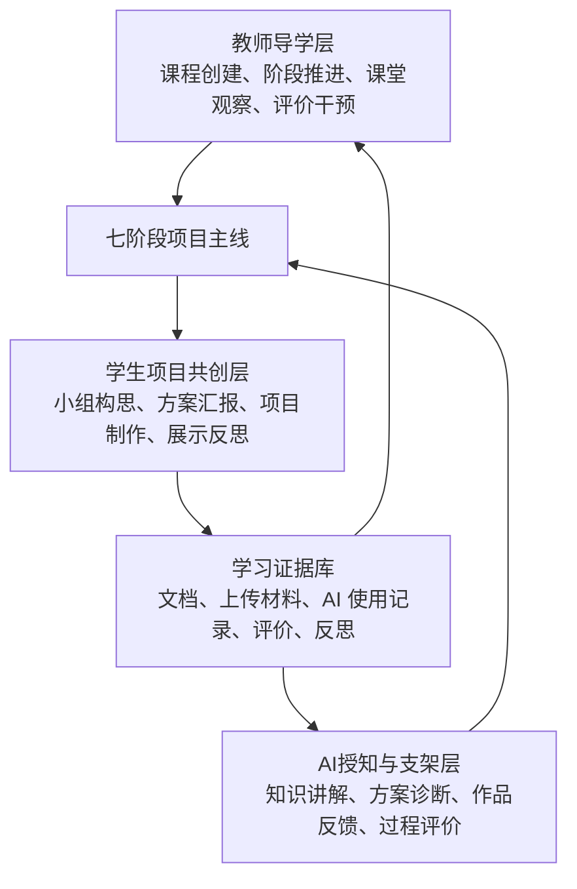
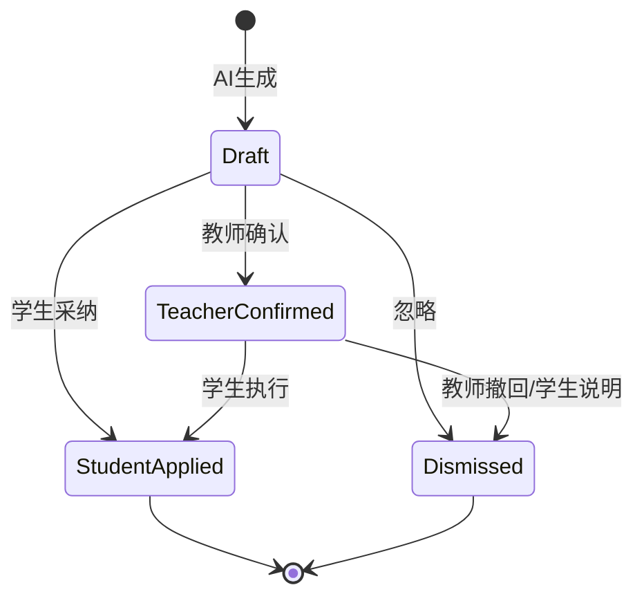

# openPBL 平台 UI/UX 全面优化方案

> 面向“AI授知、教师导学、项目共创”人工智能通识 PBL 课堂模式。  
> 目标不是给现有 demo 做皮肤美化，而是把平台升级为可真实支撑课堂组织、项目协作、AI 支架和综合评价的教学工作台。

## 1. 设计定位

### 1.1 产品一句话

openPBL 是一个由 AI 提供知识与过程支架、由教师掌控课堂节奏与质量、由学生小组完成真实项目共创的 PBL 课堂平台。

### 1.2 核心体验原则

1. **七阶段不可删减，但每阶段要有不同任务感。**  
   当前系统已有 7 个阶段，其中第 4 阶段“方案汇报”和第 5 阶段“项目制作”复用了 `workspace` 视图。优化后应保留 7 阶段主线，但让同一工作区根据阶段切换任务模板、反馈类型、提交标准和教师观察指标。

2. **教师端是课堂驾驶舱，不只是管理页。**  
   教师最需要快速回答：现在到第几阶段、哪些小组卡住、哪个环节需要我介入、是否可以推进下一阶段。

3. **学生端是项目创作台，不只是表单集合。**  
   学生每进入一个阶段都要清楚：我要完成什么、和谁协作、AI 可以帮到哪里、什么时候需要提交证据。

4. **AI 是显性支架，不是隐藏功能按钮。**  
   AI 生成内容必须标注来源、依据、状态和可采纳动作。AI 建议不直接替学生完成任务，而是提供检查、追问、修改方向和过程反馈。

5. **线下课堂与线上系统要互相映射。**  
   视觉结构采用“双轨并行”：上轨呈现 AI 系统支持，下轨呈现教师线下活动，中间用 7 阶段时间轴连接学生项目产出。

## 2. 当前体验诊断

### 2.1 已具备的功能基础

- 学生端已有项目启动、AI 授知、小组构思、项目工作区、成果展示、评价反思等页面。
- 教师端已有课程列表、备课流程、课堂阶段控制、AI 学习监控、小组进度、方案诊断、展示评分等能力。
- 数据模型已支持 `Course`、`Stage`、`ProjectGroup`、`AiSupportRecord`、`RubricScore`、`ReflectionRecord`、`CourseUpload` 等课堂核心对象。
- `DEFAULT_STAGES` 已固定 7 个阶段：项目启动、AI授知、小组构思、方案汇报、项目制作、最终展示、评价反思。

### 2.2 主要体验问题

1. **视觉语言偏基础 dashboard，缺少教育产品记忆点。**  
   当前以白卡、蓝色按钮、绿色标签为主，干净但较普通。建议升级为“清晰、可信、有课堂温度”的视觉系统，减少模板感。

2. **信息层级平均，用户要自己判断重点。**  
   例如学生工作区中，编辑器、AI 支架、反馈、活动记录都存在，但“当前最该做什么”不够突出。教师工作区也需要更强的风险优先级。

3. **阶段导航存在横向溢出和移动端不可用风险。**  
   当前 `StageStepper` 有 `min-w-[760px]`，桌面可用，但移动端和小屏投影场景容易横向滚动。阶段导航应支持桌面全量、平板压缩、手机抽屉式。

4. **第 4 和第 5 阶段体验区分不足。**  
   “方案汇报”应强调方案结构、汇报彩排、教师/同伴/AI 三方纠偏；“项目制作”应强调执行进度、材料、作品迭代、风险提醒。

5. **反馈机制分散。**  
   保存状态、AI 诊断状态、教师反馈、提交结果目前分布在各卡片和底部按钮中。建议统一为状态条、toast、任务卡状态、活动流四级反馈。

6. **可访问性和键盘体验需要系统化补齐。**  
   多处 icon button、动态状态、表单输入、弹层需要明确 `aria-label`、`aria-live`、焦点回收和 44px 触控面积。

## 3. 整体信息架构

### 3.1 三层产品结构



### 3.2 角色首页重构

首页不再只是“教师入口/学生入口”两张卡，而应表达平台模式：

- 顶部：平台名“AI 探知 · 项目共创平台”
- 主视觉：7 阶段课堂流线，突出 AI、教师、学生三方协同
- 入口：教师进入“创建/管理课堂”，学生进入“邀请码入班”
- 辅助信息：当前设备建议、最近课堂、演示课程

推荐首页结构：

```text
Header: Logo / 平台名 / AI 设置入口(教师登录后)

Hero:
  左侧: 平台名 + 一句话定位 + 教师入口 + 学生入口
  右侧: 7阶段课堂模式可视化缩略图

Mode Band:
  AI授知 | 教师导学 | 项目共创

Recent:
  教师: 最近课程
  学生: 快速重新加入 / 邀请码
```

## 4. 七阶段 UX 流程优化

### 4.1 阶段体验总表

| 阶段 | 学生端主任务 | 教师端主控制 | AI 支架 | 必须沉淀的证据 |
|---|---|---|---|---|
| 1 项目启动 | 理解驱动问题、阅读要求、加入小组 | 发布任务、解释目标、设置规则 | 背景材料、案例、驱动问题建议 | 待办完成、资源阅读、入组记录 |
| 2 AI授知 | 完成基础知识学习和小测 | 监控学习进度、提醒落后学生 | 个性化讲解、案例、小测、答疑 | 学习进度、测验记录、关键概念笔记 |
| 3 小组构思 | 选题、分工、白板构思 | 查看小组方向、提醒分工不均 | 方向建议、模板、分工参考、完整性检查 | 选题、目标、关键词、分工表、白板 |
| 4 方案汇报与纠偏 | 提交方案、彩排汇报、接收反馈 | 组织方案汇报、推送追问、确认纠偏 | 方案诊断、风险扫描、追问生成 | 方案文档、三方反馈、修订记录 |
| 5 项目制作与AI实时支架 | 制作作品、上传过程材料、迭代修改 | 巡视导学、观察停滞与依赖 AI | 作品诊断、证据缺口、伦理风险提醒 | 作品草稿、上传材料、AI 采纳记录 |
| 6 最终汇报展示 | 上传成果、演示准备、现场展示 | 控制展示节奏、评分、记录亮点 | 汇报教练、提纲检查、问答准备 | 汇报文件、展示评分、贡献记录 |
| 7 综合评价与反思 | 查看评价、写反思、制定改进计划 | 综合评价、总结收获、价值引导 | 过程评价、成长建议、证据提取 | 综合得分、自评、互评、改进计划 |

### 4.2 简化操作路径

每个阶段都采用同一套任务路径，降低学习成本：

```text
进入阶段
  -> 阅读当前目标
  -> 完成 2 到 4 个关键任务
  -> 请求 AI 检查或教师反馈
  -> 保存证据
  -> 提交阶段成果
```

界面上固定为四个区块：

1. **阶段目标条**：说明本阶段要达成什么、距离提交还差什么。
2. **主工作区**：当前阶段最主要的创作、学习或展示任务。
3. **支架与反馈区**：AI 建议、教师反馈、同伴反馈、风险提醒。
4. **证据与提交区**：待办、上传、保存、提交、阶段完成度。

### 4.3 阶段切换规则

- 教师端可以切换已开放阶段，并可推进/回退阶段。
- 学生端不能自由跳过未开放阶段，但可以查看已完成阶段的只读记录。
- 阶段推进前，教师端显示“推进确认面板”，包含：
  - 本阶段完成率
  - 未完成学生/小组
  - AI 风险提示
  - 推进后学生端将看到的内容
- 对第 4 阶段到第 5 阶段设置强校验：至少需要每组有方案文档或教师确认跳过原因。

## 5. 视觉设计规范

### 5.1 视觉方向

推荐方向：**清晰的教学科技感 + 温和的协作感 + 可解释的 AI 感**。

避免：

- 纯科技暗色界面，课堂投影和学生长时间阅读会疲劳。
- 过度紫色渐变和装饰光斑，容易显得泛 AI 产品。
- 大量浮动卡片和嵌套卡片，课堂工具应更稳、更可扫读。

采用：

- 明亮背景、清晰边界、低饱和中性色。
- 教师端主色偏蓝，学生端主色偏青绿，AI 支架使用电蓝/青色，评价与成就使用琥珀。
- 阶段色只作为辅助，不让 7 个阶段变成杂色拼盘。

### 5.2 色彩 Token

```css
:root {
  --pbl-bg: #F6F8FC;
  --pbl-surface: #FFFFFF;
  --pbl-surface-soft: #F8FAFC;
  --pbl-text: #0F172A;
  --pbl-text-muted: #64748B;
  --pbl-border: #DDE5F0;

  --pbl-teacher: #2563EB;
  --pbl-teacher-soft: #EFF6FF;
  --pbl-student: #0D9488;
  --pbl-student-soft: #F0FDFA;
  --pbl-ai: #0284C7;
  --pbl-ai-soft: #E0F2FE;
  --pbl-achievement: #F59E0B;
  --pbl-achievement-soft: #FFFBEB;
  --pbl-danger: #E11D48;
  --pbl-danger-soft: #FFF1F2;
}
```

色彩使用规则：

- 教师控制、阶段推进、班级监控：蓝色。
- 学生任务完成、小组协作、保存成功：青绿。
- AI 生成、诊断、建议、知识补充：天蓝。
- 评价、徽章、优秀案例、课堂亮点：琥珀。
- 停滞、风险、未完成、伦理提醒：玫红或红色。
- 不用颜色单独表达状态，必须配合文字或图标。

### 5.3 字体与字号

中文优先：

```css
font-family:
  "Noto Sans SC",
  "Microsoft YaHei",
  "PingFang SC",
  "Hiragino Sans GB",
  sans-serif;
```

字号层级：

| 用途 | 字号 | 行高 | 字重 |
|---|---:|---:|---:|
| 页面标题 | 32px | 40px | 800 |
| 阶段标题 | 26px | 34px | 800 |
| 卡片标题 | 18px | 26px | 700 |
| 正文 | 15-16px | 26-28px | 400 |
| 辅助说明 | 13-14px | 22px | 400 |
| 数字指标 | 28-48px | 1.1 | 800 |

中文内容页正文不要低于 15px；学生端移动端正文最低 16px。

### 5.4 间距、圆角、阴影

```css
--space-1: 4px;
--space-2: 8px;
--space-3: 12px;
--space-4: 16px;
--space-5: 20px;
--space-6: 24px;
--space-8: 32px;

--radius-sm: 6px;
--radius-md: 8px;
--radius-lg: 12px;

--shadow-card: 0 10px 30px rgba(15, 23, 42, 0.06);
--shadow-popover: 0 24px 64px rgba(15, 23, 42, 0.18);
```

规则：

- 普通卡片圆角 8px。
- 入口页、阶段主工作区可用 12px。
- 不使用超过 16px 的大圆角作为默认风格。
- 阴影只用于浮层、主工作区、可点击课程卡。普通信息区以边框分隔为主。

### 5.5 图标与插图

- 图标使用 `lucide-react`，线宽统一 1.8 到 2。
- 阶段图标建议：
  - 项目启动：Flag / Compass
  - AI授知：Bot / BookOpen
  - 小组构思：Users / Lightbulb
  - 方案汇报：ClipboardCheck / MessageSquare
  - 项目制作：PenTool / Hammer / FileText
  - 最终展示：Presentation / MonitorPlay
  - 评价反思：Star / Radar / ClipboardList
- 首页与项目启动页可以使用真实或生成的课堂场景图，但不要用抽象渐变替代可理解场景。

## 6. 布局结构图

### 6.1 全局壳层

```text
┌────────────────────────────────────────────────────────────┐
│ 顶部栏：Logo / 当前课程 / 当前阶段 / AI设置 / 通知 / 用户 │
├────────────────────────────────────────────────────────────┤
│ 阶段主线：7阶段 stepper + 阶段状态 + 教师推进按钮          │
├────────────────────────────────────────────────────────────┤
│ 页面内容：根据角色和阶段渲染                               │
└────────────────────────────────────────────────────────────┘
```

优化建议：

- 顶部栏保持 64px，高频课堂操作不放进隐藏菜单。
- 阶段主线在课堂中始终可见，但滚动后压缩成 sticky mini bar。
- 学生端显示“当前阶段由教师控制”，减少误解。
- 教师端显示“推进下一阶段”主按钮，旁边是阶段完成度和风险数。

### 6.2 教师端课堂驾驶舱

```text
┌──────────────────────────────────────────────────────────────┐
│ 课堂状态横幅：阶段、倒计时、完成率、需介入小组、邀请码       │
├───────────────┬──────────────────────────────┬───────────────┤
│ 小组/学生列表 │ 当前关注对象详情             │ AI观察与干预   │
│ - 进度排序    │ - 文档/作品/上传材料          │ - 风险原因     │
│ - 风险标签    │ - 分工/贡献/历史反馈          │ - 推荐追问     │
│ - 在线状态    │ - 教师留言与评分              │ - 一键推送     │
├───────────────┴──────────────────────────────┴───────────────┤
│ 课堂活动流 / 阶段提交情况 / 推进确认                          │
└──────────────────────────────────────────────────────────────┘
```

桌面端建议栅格：

- 12 列布局。
- 左侧对象列表 3 列。
- 中央详情 6 列。
- 右侧 AI 干预 3 列。

教师端重点组件：

- 班级状态条：平均进度、完成数、停滞数、AI 分析更新时间。
- 风险队列：按高风险、待确认、稳定推进排序。
- 关注对象详情：小组文档、上传材料、分工、反馈历史。
- 干预操作：推送追问、发起一对一、标记已线下处理、推进阶段。

### 6.3 学生端阶段工作台

```text
┌──────────────────────────────────────────────────────────────┐
│ 阶段目标条：本阶段目标 / 完成条件 / 个人或小组进度            │
├──────────────────────────────────────────┬───────────────────┤
│ 主工作区                                 │ 支架侧栏           │
│ - 学习内容 / 白板 / 文档 / 上传 / 反思    │ - AI建议           │
│ - 当前任务表单                           │ - 教师反馈         │
│ - 小组协作内容                           │ - 证据缺口         │
├──────────────────────────────────────────┴───────────────────┤
│ 底部操作条：保存 / 请求检查 / 提交 / 查看历史                 │
└──────────────────────────────────────────────────────────────┘
```

学生端重点：

- 主工作区只放当前阶段最核心任务，避免所有能力同时摊开。
- AI 支架侧栏可折叠，但折叠后保留未读数量和风险提示。
- 底部操作条 sticky，包含保存、AI 检查、提交三类动作。
- 每次提交后进入“提交成功 + 下一步说明”状态，而不是停留在同一表单。

### 6.4 移动端布局

移动端不是缩小桌面，而是改成任务流：

```text
顶部：课程 + 阶段
阶段进度：横向胶囊 stepper
当前任务卡
主操作区
支架/反馈 tabs
证据与提交
```

移动端规则：

- 所有点击目标最小 44px。
- 表格转换为卡片列表。
- 教师端大屏监控功能在手机上优先展示“风险队列”和“推进控制”，复杂评分可进入二级页。
- 学生端文档编辑器在手机上默认进入简化模式，保留标题、段落、列表、图片上传。

## 7. 页面级优化方案

### 7.1 首页

目标：让用户一眼知道这是 PBL 课堂平台，不只是身份选择页。

优化：

- 加入 7 阶段模式缩略图，保留教师/学生入口。
- 教师入口文案改为“创建课程、发布课堂、实时导学”。
- 学生入口文案改为“输入邀请码、加入小组、完成项目”。
- 对未登录/未加入课堂状态给出清晰空状态。

### 7.2 教师课程列表

优化：

- 顶部增加“今天正在授课”“待发布”“最近修改”三个快捷区。
- 课程卡信息层级：课程名、状态、当前阶段、完成率、最近活动、主操作。
- 状态筛选同步到 URL，刷新后保留筛选。
- 空状态根据 tab 给具体下一步动作。

### 7.3 教师备课流程

建议从“表单式创建”升级为“课程生成向导”：

1. 基本信息：主题、年级、课时、班级规模。
2. 项目骨架：驱动问题、成果形式、评价维度。
3. AI 授知内容：知识点、场景、测验、互动活动。
4. 7 阶段编排：每阶段目标、产出、时长、AI 权限。
5. 发布确认：学生看到什么、教师可控项、邀请码。

每一步固定显示：

- 左侧输入区
- 右侧 AI 建议/预览
- 底部保存草稿、下一步

### 7.4 教师授课页

目标：课堂中少点跳转，多点决策。

核心布局：

- 顶部课堂状态横幅：
  - 当前阶段
  - 阶段完成率
  - 需介入数量
  - AI 分析更新时间
  - 推进下一阶段
- 主区：
  - 左：学生/小组队列
  - 中：当前对象详情
  - 右：AI 风险与教师干预
- 底部：
  - 活动流
  - 关键提交
  - 课堂备注

### 7.5 学生入班页

优化：

- 邀请码输入使用 6 位分格输入，自动大写。
- 错误反馈紧贴输入框，如“邀请码不存在”“课堂已结束”。
- 已离开课堂记录做成“最近课堂”卡片，减少重复输入。
- 加入成功后显示“你将进入第 X 阶段”，再自动跳转。

### 7.6 学生课堂页

优化：

- 顶部显示当前小组、当前阶段、整体进度。
- 每个阶段统一“任务清单 + 主工作区 + 支架反馈 + 提交”。
- 已完成阶段可回看，未开放阶段只显示简介和开启条件。
- AI 对话入口根据教师开关显示，避免所有阶段都开放造成依赖。

## 8. 阶段页面设计细化

### 8.1 阶段一：项目启动

页面目标：让学生理解真实问题，并完成入组准备。

布局：

- 首屏用“驱动问题”作为主视觉核心，不再先展示大图。
- 右侧为学生待办：阅读项目说明、选择兴趣方向、加入小组。
- 资源区按“必读、选读、评价标准”分组。
- 课堂公告与讨论放到下方，避免压过主任务。

关键交互：

- 学生点击“我已理解项目目标”后完成待办。
- 加入小组后底部主按钮变为“进入小组构思准备”。
- AI 背景材料以“可展开资料卡”展示，不打断教师导入。

### 8.2 阶段二：AI授知

页面目标：完成基础知识学习，教师可确认全班是否达标。

学生端：

- 左侧/主区为 OpenMAIC 课堂嵌入。
- 右侧显示知识地图：已学、进行中、待学。（为避免干扰openmaic界面，可以进行浮窗展示和隐藏）
- 每个知识点有“掌握状态、错题/问题、与项目关系”。

教师端：

- 班级平均进度、未开始、进行中、已完成。
- 知识点掌握热力图。
- 落后学生队列支持一键推送提醒或线下点名。

### 8.3 阶段三：小组构思

页面目标：让学生把真实问题转化为可执行项目。

优化：

- 选题、成果形式、分工计划、白板分成四个步骤，但在同一页面完成。
- AI 方案检查器固定为右侧侧栏，强调“不代写，只检查”。
- 白板默认有模板：问题、用户、方案、证据、风险、成果。
- 分工表支持角色模板，不要求学生从空白开始。

### 8.4 阶段四：方案汇报与纠偏

这是需要重点补强的阶段。

学生端主区：

- 方案文档结构化为 6 个必填模块：
  1. 要解决的问题
  2. 目标用户或使用场景
  3. 成果形式
  4. 实施步骤
  5. AI 使用方式
  6. 风险与备选方案
- 提供“汇报彩排”模式：按 3 分钟或 5 分钟生成讲稿提纲。
- 三方反馈合并显示：AI 检查、教师纠偏、同伴提问。

教师端主区：

- 每组一张方案诊断卡：
  - 完整度
  - 可行性
  - 风险
  - 推荐追问
  - 是否允许进入制作
- 支持批量诊断，但教师最终确认才能推进。

### 8.5 阶段五：项目制作与 AI 实时支架

学生端主区：

- 作品编辑/上传区为主。
- 左侧或顶部显示任务看板：待做、进行中、已完成。
- AI 支架拆成三个按钮：
  - 检查实施步骤
  - 查找证据缺口
  - 扫描风险与伦理
- AI 建议必须提供“采纳、稍后处理、忽略并说明原因”。

教师端主区：

- 风险队列优先：
  - 停滞
  - 证据不足
  - 过度依赖 AI
  - 偏离主题
- 教师可以给小组推送支架，也可以标记“已线下指导”。

### 8.6 阶段六：最终汇报展示

学生端：

- 成果上传列表分为必交和选交。
- 演示预览支持 PPT/PDF/视频/图片。
- 演示计时器在汇报模式中放大显示。
- 团队贡献记录在提交前必填。
- AI 汇报教练输出：结构、证据、表达、问答准备。

教师端：

- 展示控制台：
  - 当前汇报小组
  - 倒计时
  - 评分量规
  - 快速记录亮点/问题
  - 下一组
- 评分完成后学生端同步展示“已收到评价”。

### 8.7 阶段七：综合评价与反思

学生端：

- 综合评价分四栏：
  - AI 过程评价
  - 教师评价
  - 同伴互评
  - 自我反思
- 反思输入不应只是大文本框，应提供提示：
  - 我学到了什么
  - 我如何使用 AI
  - 我如何判断 AI 输出
  - 下一次如何改进
- 成长报告支持下载或展示。

教师端：

- 汇总班级表现、优秀案例、共性问题。
- 支持发布“课堂总结”给全班。
- 支持导出评价数据和过程证据。

## 9. 组件与元素组合规则

### 9.1 层级系统

页面元素按 5 层组织：

1. **全局导航层**：顶部栏、课程切换、通知、用户菜单。
2. **阶段控制层**：7 阶段 stepper、阶段状态、推进按钮。
3. **任务主层**：当前阶段最核心的工作区。
4. **支架反馈层**：AI、教师、同伴反馈。
5. **证据记录层**：活动流、上传材料、历史记录、评价记录。

任何页面不得让支架反馈层抢占任务主层的视觉权重，除非出现高风险阻断。

### 9.2 卡片使用规则

适合用卡片：

- 课程卡、小组卡、学生卡。
- 任务清单、AI 建议、教师反馈、评价结果。
- 上传材料、资源、公告。
- 指标面板和风险队列。

不适合用卡片：

- 整个页面大区域再套多层卡片。
- 表单里每个输入项单独成卡。
- 普通段落说明。

卡片内部规则：

- 标题区固定在上方。
- 主内容在中间。
- 操作按钮在右上或底部，不混在正文段落中。
- 同一卡片内最多 2 个主按钮，更多操作进入菜单或二级面板。

### 9.3 可重叠元素规则

允许重叠：

- 顶部弹出菜单覆盖页面内容。
- 文件预览 overlay 覆盖全屏。
- Toast 覆盖右上角或底部。
- AI 支架侧栏在小屏上以抽屉覆盖主区。
- 头像堆叠用于小组成员展示。

不允许重叠：

- 阶段导航遮挡页面标题。
- sticky 底部操作条遮挡表单最后一项。
- AI 对话入口遮挡提交按钮。
- 计时器覆盖评分量规。
- 弹层打开后背景仍可滚动或继续操作。

### 9.4 Z-index 规则

```text
z-10  sticky 阶段条、表头
z-20  顶部导航
z-30  下拉菜单、popover
z-40  右侧抽屉、文件预览
z-50  modal、确认推进弹窗
z-60  toast、全局错误提示
```

避免使用任意超大 z-index。

### 9.5 操作按钮规则

按钮分为四类：

- 主按钮：推进、提交、开始演示、进入课堂。
- 次按钮：保存、预览、刷新诊断。
- 风险按钮：删除、退出小组、结束课堂。
- AI 按钮：生成、检查、诊断、提取证据。

规则：

- 每屏只保留一个最显眼主按钮。
- AI 按钮必须带 `Sparkles` 或 `Bot` 类图标，并标注“AI”。
- 危险操作必须二次确认。
- 异步按钮超过 300ms 必须进入 loading 状态，完成后给成功或失败反馈。

## 10. 交互反馈机制

### 10.1 四级反馈

1. **即时反馈**：按钮按下、hover、active、focus。
2. **局部反馈**：输入框错误、卡片状态、AI 诊断 loading。
3. **全局反馈**：toast、通知中心、活动流。
4. **流程反馈**：阶段完成度、提交状态、教师确认状态。

### 10.2 AI 建议状态机



显示规则：

- `draft`：浅蓝，标注“AI 建议，待处理”。
- `teacher-confirmed`：蓝色，标注“教师已确认”。
- `student-applied`：绿色，标注“已采纳”。
- `dismissed`：灰色，折叠到历史记录。

### 10.3 保存与提交

- 自动保存：编辑器每 30 秒保存一次，显示“已保存于 21:32”。
- 手动保存：底部操作条固定可见。
- 提交：提交后锁定版本，但允许“申请重新提交”。
- 离开页面：有未保存内容时提示。

### 10.4 错误与空状态

空状态必须包括：

- 发生了什么。
- 为什么当前为空。
- 用户下一步能做什么。

示例：

- “该小组尚未提交方案文档。你可以先推送方案模板，或在线下提醒组长提交。”
- “暂无 AI 诊断。点击‘检查方案完整性’，系统会基于选题、目标和分工生成修改建议。”

## 11. 响应式适配

### 11.1 断点

```text
mobile: 360-767
tablet: 768-1023
desktop: 1024-1439
wide: 1440+
```

### 11.2 桌面

- 教师端默认三栏。
- 学生端默认两栏，主工作区加右侧支架。
- 数据表格允许横向滚动，但关键字段要冻结或转卡片。

### 11.3 平板

- 教师端左侧列表 + 详情上下布局，AI 干预变成右侧抽屉。
- 学生端主工作区全宽，支架区变成 tabs。

### 11.4 手机

- 不保留 `min-w-[1060px]` 这类固定页面宽度。
- 阶段 stepper 改成横向胶囊条或“阶段 X/7”下拉。
- 大表格全部卡片化。
- 底部操作条用 1 个主按钮 + 更多菜单。

## 12. 无障碍与可用性要求

必须达成：

- 文本对比度不低于 WCAG AA。
- 所有 icon-only button 有 `aria-label`。
- 动态状态如“AI 正在诊断”使用 `aria-live="polite"`。
- 表单控件有可见 label，不只依赖 placeholder。
- 键盘 Tab 顺序与视觉顺序一致。
- Modal 打开后焦点进入弹窗，关闭后回到触发按钮。
- 尊重 `prefers-reduced-motion`。
- 移动端触控目标不小于 44px。

## 13. 微文案规范

### 13.1 语气

- 教师端：明确、可决策、降低课堂管理负担。
- 学生端：鼓励行动、强调自主判断，不让 AI 显得替代思考。
- AI 文案：必须可解释，有依据，有边界。

### 13.2 示例

按钮：

- “检查方案完整性”
- “生成汇报检查清单”
- “推送追问给该组”
- “保存改进计划”
- “确认并推进下一阶段”

状态：

- “AI 正在读取方案文档和分工记录…”
- “已生成诊断，请先确认后推送给学生”
- “已采纳建议，并记录到过程证据”
- “仍有 3 个小组未提交方案，建议暂缓推进”

AI 边界提示：

- “AI 只提供检查和修改建议，最终方案需要小组自己确认。”
- “以下反馈基于当前上传材料生成，若材料不完整，判断可能不充分。”

## 14. 数据可视化规范

教师端适合：

- 进度条：学生/小组完成度。
- 风险标签：停滞、缺证据、偏题、依赖 AI。
- 热力图：知识点掌握。
- 队列：需介入优先级。
- 雷达图：评价维度。

学生端适合：

- 阶段完成圆环。
- 任务清单进度。
- 成长雷达图。
- 里程碑。

规则：

- 不用复杂图表堆叠。
- 每个图表必须配一句解释。
- 分数、排名、评价必须说明来源。

## 15. 关键页面线框

### 15.1 教师授课页线框

```text
┌──────────────────────────────────────────────────────────────┐
│ 阶段 4/7 方案汇报与纠偏 | 完成率 72% | 需介入 3 | 推进下一阶段 │
├───────────────┬──────────────────────────────┬───────────────┤
│ 小组队列       │ 绿色校园行动小组              │ AI观察         │
│ [高] A组 25%   │ 方案摘要                       │ 风险：证据不足 │
│ [中] B组 60%   │ 上传材料                       │ 推荐追问       │
│ [稳] C组 90%   │ 教师反馈输入                   │ [确认并推送]   │
├───────────────┴──────────────────────────────┴───────────────┤
│ 活动流：A组提交方案 / 教师推送追问 / B组更新文档              │
└──────────────────────────────────────────────────────────────┘
```

### 15.2 学生项目制作页线框

```text
┌──────────────────────────────────────────────────────────────┐
│ 阶段 5/7 项目制作 | 本阶段目标：完成作品初稿并提交证据          │
├──────────────────────────────────────────┬───────────────────┤
│ 项目文档 / 作品编辑器                     │ AI任务支架         │
│ 工具栏                                    │ [检查步骤]         │
│ 正文                                      │ [证据缺口]         │
│ 上传材料                                  │ [风险伦理]         │
│                                           │ 教师反馈           │
├──────────────────────────────────────────┴───────────────────┤
│ 已保存 21:32 | 保存草稿 | 请求 AI 检查 | 提交阶段成果           │
└──────────────────────────────────────────────────────────────┘
```

### 15.3 评价反思页线框

```text
┌──────────────────────────────────────────────────────────────┐
│ 个人评价与反思 | 项目：校园低碳生活解决方案                    │
├──────────────┬──────────────┬──────────────┬────────────────┤
│ AI过程评价    │ 教师评价      │ 同伴互评      │ 综合得分         │
│ 雷达图        │ 文字反馈      │ 星级+建议     │ 88/100          │
├──────────────────────────────┬───────────────────────────────┤
│ 自我反思输入                  │ 成长建议 / 下一轮行动            │
└──────────────────────────────┴───────────────────────────────┘
```

## 16. 前端实施建议

### 16.1 组件拆分

建议新增或重构以下组件：

- `AppShell`：替代当前固定 min-width 的 `DashboardShell`，支持 responsive。
- `StageRail`：桌面完整阶段条、移动端压缩阶段选择。
- `StageGoalBar`：每阶段目标、完成条件、当前状态。
- `ActionDock`：底部 sticky 操作条。
- `AiSupportCard`：统一 AI 建议状态、依据、采纳动作。
- `TeacherRiskQueue`：教师端风险队列。
- `EvidencePanel`：上传材料、活动流、提交记录统一入口。
- `StageTaskChecklist`：学生端阶段任务清单。
- `AdvanceStageDialog`：教师推进阶段确认。
- `ResponsiveDataList`：表格到卡片的适配组件。

### 16.2 阶段视图调整

- 保持 `DEFAULT_STAGES` 七阶段不变。
- 为 `workspace` 增加 `stageKey` 分支：
  - `review` 渲染方案汇报模板。
  - `make` 渲染项目制作模板。
- 教师端 `WorkspaceTeacherView` 同样按 `stageKey` 显示不同诊断与操作。

### 16.3 样式策略

- 继续使用 Tailwind，但把核心 token 写入 `globals.css` 或主题层。
- 将常用样式收敛到 UI 组件，不在页面里重复堆 class。
- 减少 `transition-all`，改为 `transition-colors`、`transition-transform`。
- 避免 `min-w-[1060px]` 这类全局桌面锁宽。

### 16.4 验收标准

视觉：

- 教师端和学生端主色区分明确，但组件语言一致。
- 7 个阶段在所有页面都可识别。
- 页面首屏能明确当前任务与下一步动作。

流程：

- 教师 3 秒内能看到哪些小组需要介入。
- 学生 3 秒内能知道本阶段要提交什么。
- 第 4 和第 5 阶段有明显不同的界面目标。

交互：

- 所有异步 AI 操作有 loading、成功、失败、重试。
- 所有提交都有版本状态和活动记录。
- 弹层、下拉、抽屉键盘可操作。

响应式：

- 360px 宽度无横向页面滚动。
- 平板可完成学生端核心任务。
- 教师端手机可查看风险队列并推进阶段。

## 17. 改版优先级

### P0：先解决课堂主流程

1. 重构阶段导航和课堂壳层，去掉全局固定最小宽度。
2. 区分第 4 阶段方案汇报和第 5 阶段项目制作。
3. 学生端统一阶段目标条和底部操作条。
4. 教师端统一课堂状态横幅和风险队列。

### P1：提升 AI 与反馈体验

1. 统一 `AiSupportCard`。
2. AI 建议增加采纳、忽略、依据、状态。
3. 教师推进阶段前增加确认弹窗。
4. 活动流和通知中心合并为可追溯课堂记录。

### P2：视觉系统与响应式完善

1. 全局 token、按钮、卡片、表单、标签统一。
2. 移动端任务流布局。
3. 表格卡片化。
4. 空状态、错误状态、加载骨架统一。

### P3：增强展示与报告

1. 成长报告可视化。
2. 课堂总结导出。
3. 首页模式展示升级。
4. 优秀案例库和复盘页。

## 18. 最终效果目标

优化后的平台应达到以下体验：

- 学生进入课堂后，不需要问“我现在该做什么”。
- 教师进入授课页后，不需要翻多个页面找“谁需要我帮忙”。
- AI 建议不再像零散按钮，而成为可解释、可确认、可追踪的教学支架。
- 7 个阶段既保持完整，又在界面上具有清晰的任务差异。
- 平台视觉从普通 demo 升级为可信、现代、适合中小学课堂使用的产品级界面。
